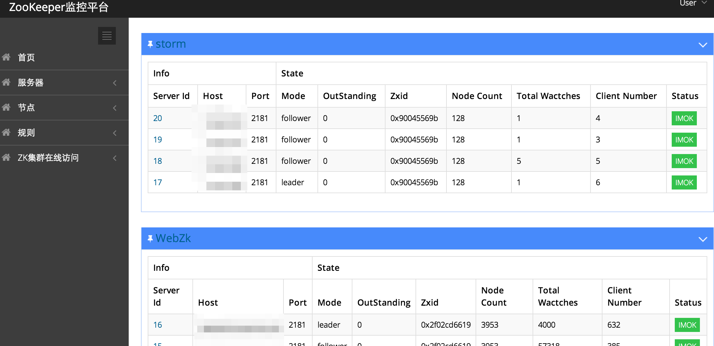
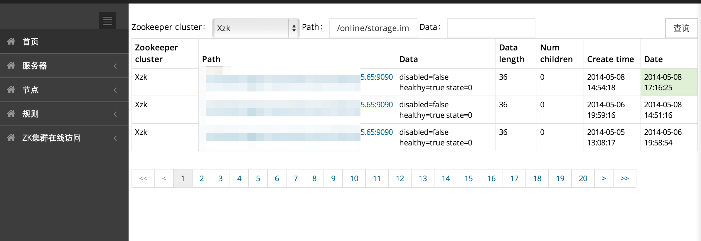

# Mario
- - -
A ZooKeeper monitor platform.
一个ZooKeeper的监控报警平台

##如果部署监控平台
* 部署[maven](http://maven.apache.org/)环境
* 得到一个[jetty](http://www.eclipse.org/jetty/)或[tomcat](http://www.eclipse.org/jetty/)服务器
* 配置Mysql服务器
* 检出项目
`git clone https://github.com/ZheYuan/Mario.git`
* 导入数据库表结构和基础数据   
```
cd Mario   
mysql -u root -p xweb < Documents/Mario.sql
```

##编译使用Mario工程
Mario工程是ZooKeeper监控的展示和配置系统。

* 此工程依赖[springside](https://github.com/springside/springside4)项目的4.0.0GA版本，位于thirdparty目录下。   
编译springside   
```   
cd Mario/Mario/thirdparty   
unzip springside4-4.0.0.GA.zip   
cd springside4-4.0.0.GA   
mvn install
```
* 修改数据库配置文件
```
vim Mario/Mario/src/main/resources/application.properties
```
* 将工程打成war包，目前请先跳过测试
```
cd Mario/Mario
mvn package -Dmaven.test.skip=true
```
* 发布运行   
```
cp -v Mario/Mario/target/Mario.jar $JETTY_HOME/webapps/Mario.jar   
$JETTY_HOME/bin/jetty.sh start
```
* 默认用户名和密码   
`admin:admin`

##Wario工程
Wario工程是ZooKeeper的监控报警系统。

* 修改数据库配置文件   
```
vim Mario/Wario/src/main/resources/application.properties
```
* 修改`DefaultMsgSender/DefaultMailSender`或添加扩展的报警类或使用调试的类`DebugMsgSender/DebugMailSender`
* 编译工程   
```
./Mario/Wario/build.sh
```
* 运行   
```
./Mario/Wario/run.sh start
```

##自定义扩展插件

* 先编译Wario项目
* 导入WarioSample的maven工程
* 实现`IPlugin`接口
* 将写好的插件导出为jar包放入`Mario/Wario/plugins/`路径，插件将采用反射的方式被载入

##插件说明

* RulePlugin用来处理报警的规则。默认运行于集群所有集群上，通过`DefaultMsgSender`和`DefaultMailSender`类发送报警
* DBPlugin用来将集群的基本信息写入数据库。默认运行于集群的所有机器上，无报警
* ObserverPlugin用来将集群中的数据定期写入数据库，用来做历史记录查询。只运行于集群的Observer上，如果不配置Observer或者不加此插件将不会运行，无报警
* DefaultPlugin用来监控集群的监控状态并发送报警。运行于配置集群的每一个服务器上，报警通过配置的接口发送
* ReadWriteTestPlugin用来测试服务的可用性并发送报警。运行于配置集群的每一个服务器上，报警通过配置的接口发送

##系统截图







